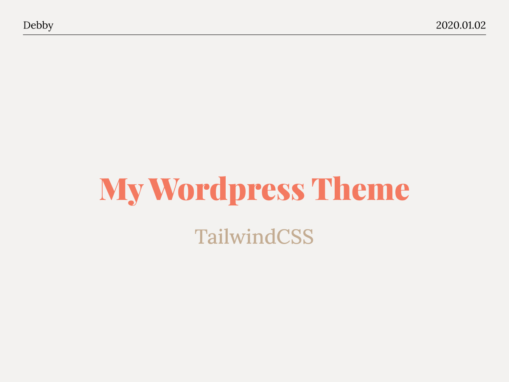

- Website Link : https://www.debbylin.me/

---

## Commands

### `npm run dev`
Assets will be compiled and BrowserSync will proxy the dev host allowing you to work while seeing your CSS and JS changes appear on the site as they are recompiled.

### `npm run webpack`
Runs the development build

### `npm run prod`
Runs the product build which includes asset file versioning and Purge CSS

---

- Source From : [wp-tailwindcss-theme-boilerplate](https://github.com/mishterk/wp-tailwindcss-theme-boilerplate)

---

## 📚 Learn to build Wordpress theme：
- [WordPress theme development with Tailwind CSS and Laravel Mix | Article](https://philkurth.com.au/articles/wordpress-theme-using-tailwind-css/)
- [WordPress Tutorial: Developing a Wordpress Theme from Scratch | Article](https://www.taniarascia.com/developing-a-wordpress-theme-from-scratch/)
- [How to Create a Custom WordPress Theme - Full Course | Youtube](https://www.youtube.com/watch?v=-h7gOJbIpmo&list=PLm9AVYpgeBu3tT8u9lbP28CrVYhq5xAtM&index=6&ab_channel=freeCodeCamp.org)
- [WordPress Theme Development Tutorial 2020| Youtube](https://www.youtube.com/watch?v=MoO-UsIvFIs&list=PLm9AVYpgeBu3tT8u9lbP28CrVYhq5xAtM&index=2&ab_channel=AdrianTwarog)
