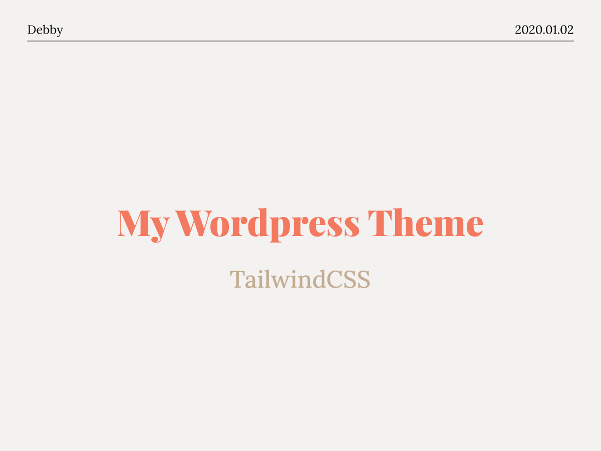

[](https://www.debbylin.me/)

- Website Link : https://www.debbylin.me/


---

## 排除 Projects
為了在分類排除 Projects 底下的文章，在這些檔案都有排除：
> 在 vscode 搜尋 `27` or `29` (Project 的分類 ID) 
> - Local Project category ID : `29`
> - Production Project category ID : `27`

1. functions.php
2. widget-archive.php
3. post-footer.php

---


## Commands

### `npm run dev`
Assets will be compiled and BrowserSync will proxy the dev host allowing you to work while seeing your CSS and JS changes appear on the site as they are recompiled.

### `npm run webpack`
Runs the development build

### `npm run prod`
Runs the product build which includes asset file versioning and Purge CSS


---

## 開發與打包流程說明

### `npm run dev` 開發模式

執行後 Laravel Mix 會：
1. 編譯 `assets/scss/app.scss` → `build/css/app.css`（無 hash）
2. 編譯 `assets/js/app.js` → `build/js/app.js`（無 hash）
3. 啟動 BrowserSync，proxy 本地 WordPress 站台
4. 監聽檔案變更，自動重新編譯並重載頁面

開發模式下，WordPress 透過 `build/local-manifest.json`（如果存在且 `WP_DEBUG` 為 true）來載入無 hash 的 `app.css` / `app.js`，確保每次修改都能即時反映。

> **注意**：`build/css/app.css` 與 `build/js/app.js` 已被 `.gitignore` 忽略，不會進入版本控制。

### `npm run prod` 正式打包

執行後 Laravel Mix 會：
1. 編譯並壓縮 SCSS/JS
2. 產生帶有 hash 的檔案，例如 `build/css/app.05ceca.css`、`build/js/app.0a1ec2.js`
3. 更新 `build/mix-manifest.json`，記錄 hash 對應表：
   ```json
   {
     "/css/app.css": "/css/app.05ceca.css",
     "/js/app.js": "/js/app.0a1ec2.js"
   }
   ```
4. 帶 hash 的檔案與 `mix-manifest.json` 需要 commit 進版本控制

### WordPress 如何自動載入 CSS / JS

整個載入流程由以下檔案串聯：

| 檔案 | 功能 |
|---|---|
| `app/AssetResolver.php` | 讀取 manifest 檔案，將 `css/app.css` 解析為實際帶 hash 的路徑 |
| `build/mix-manifest.json` | 正式環境的 hash 對應表（prod 打包產生） |
| `build/local-manifest.json` | 開發環境的對應表（dev 模式產生，`WP_DEBUG=true` 時優先使用） |
| `includes/scripts-and-styles.php` | 呼叫 `AssetResolver::resolve()` 取得路徑，再用 `wp_enqueue_style` / `wp_enqueue_script` 載入 |

**載入順序**：
```
assets/scss/app.scss → (編譯) → build/css/app.{hash}.css
                                       ↓
                            mix-manifest.json 記錄 hash
                                       ↓
                         AssetResolver.php 讀取 manifest 解析路徑
                                       ↓
                    scripts-and-styles.php 用 wp_enqueue_style 載入到前端
```

---

- Source From : [wp-tailwindcss-theme-boilerplate](https://github.com/mishterk/wp-tailwindcss-theme-boilerplate)

---

## 📚 Learn to build Wordpress theme：
- [WordPress theme development with Tailwind CSS and Laravel Mix | Article](https://philkurth.com.au/articles/wordpress-theme-using-tailwind-css/)
- [WordPress Tutorial: Developing a Wordpress Theme from Scratch | Article](https://www.taniarascia.com/developing-a-wordpress-theme-from-scratch/)
- [How to Create a Custom WordPress Theme - Full Course | Youtube](https://www.youtube.com/watch?v=-h7gOJbIpmo&list=PLm9AVYpgeBu3tT8u9lbP28CrVYhq5xAtM&index=6&ab_channel=freeCodeCamp.org)
- [WordPress Theme Development Tutorial 2020| Youtube](https://www.youtube.com/watch?v=MoO-UsIvFIs&list=PLm9AVYpgeBu3tT8u9lbP28CrVYhq5xAtM&index=2&ab_channel=AdrianTwarog)
